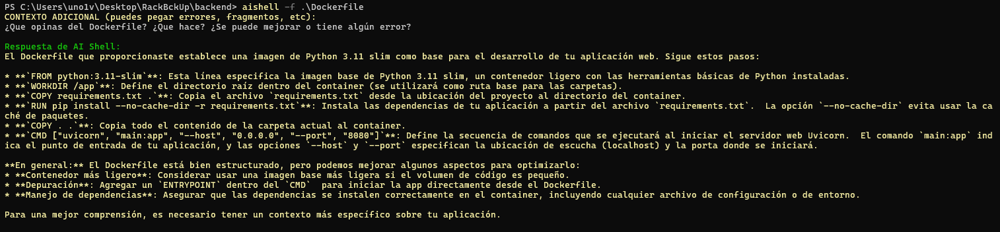

## AISHELL

(Es la versión local de https://github.com/valarcon42madrid/aishell2 ; por ello reutilizo el directorio grokAIshell/ pero puedes crear uno diferente para mayor claridad)

---

# 🚀 ¿Qué es `aishell`?

aishell es un comando personalizable que permite usar historial de terminal, archivos relevantes, errores recientes y contexto manual para recibir asistencia de un modelo de lenguaje (LLM) en local.

Puede ayudarte a:

Diagnosticar errores en terminales Bash/PowerShell.

Sugerir correcciones de comandos.

Interpretar archivos como Dockerfile, docker-compose.yml, .env, .json, .yml, etc.

Recibir instrucciones prácticas y coloreadas para ejecución directa en tu terminal.


## Modos de Uso

| Modo | Descripción |
|:--|:--|
| `-f archivo1,archivo2` | Incluye uno o varios archivos en el contexto enviado. |
| `-d directorio` | Incluye todos los archivos especiales (.yml, .json, Dockerfile, etc.) de un directorio. |
| -p N	| Añade los últimos N comandos de PowerShell al contexto. |
| -b N	| Añade los últimos N comandos de Bash al contexto. |
| -e pN,bM	| Añade errores recientes: pN para PowerShell y bM para Bash. Ej: -e p3,b5. |
| `-full` | Envía archivos completos, ignorando el límite de 500 líneas o 32 KB. |
| `-h` | Muestra la ayuda de uso rápida. |

---

# ⚠️ Riesgos y Advertencias

**IMPORTANTE:**  
Cuando usas `aishell`, usas ollama + Gemma en tu PC, de manera que consume recursos. Además puede tardar un rato (de un minuto a tres) y generar respuestas algo imprecisas.

---

# ⚙️ Configuración paso a paso

## 1️⃣ Obtener ollama

- Descargala para Windows en [Ollama web](https://ollama.com/download).
- Ejecuta el archivo para tener ollama en tu CMD.
- Descarga gemma para no depender de tener conexión a internet:

```CMD
ollama run gemma2:2b
```

---

## 2️⃣ Configurar alias en PowerShell7

En PowerShell 7:

1. Abre tu perfil:

```powershell
notepad $PROFILE
```

2. Añade esta línea al final:

```powershell
Set-Alias aishell "C:\Users\TU_USUARIO\grokAIshell\aishell1.ps1"
```
**¡Esto es suponiendo que ubiques aishell1.ps1 en C:\Users\TU_USUARIO\grokAIshell\ !**

✅ Ahora podrás usar `aishell` directamente en PowerShell7.

* Recuerda que el historial de Bash/WSL2 que reciba será el último guardado, de modo que si tienes ambos terminales abiertos deberás cerrar bash o hacer history -a para que aishell pueda verlo actualizado.

---

## 3️⃣ Configurar función en Bash (WSL2)

En tu terminal Bash:

1. Abre tu `.bashrc`:

```bash
nano ~/.bashrc
```

2. Pega la función completa (y, si usaste mis rutas, sustituye YOURUSERNAME por el tuyo):

```bash
function aishell() {
    local bash_dir
    bash_dir=$(pwd)
    history -a

    local distro_name
    distro_name=$(wsl.exe -l --quiet --running | grep '*' | sed 's/\*//g' | awk '{$1=$1};1')

    if [[ "$bash_dir" == /mnt/* ]]; then
        drive_letter=$(echo "$bash_dir" | cut -d'/' -f3)
        path_rest=$(echo "$bash_dir" | cut -d'/' -f4-)
        windows_dir="${drive_letter^^}:\\"$(echo "$path_rest" | sed 's|/|\\|g')
        pwsh.exe -NoLogo -WorkingDirectory "$windows_dir" -ExecutionPolicy Bypass -File C:\\Users\\<YOURUSERNAME>\\grokAIshell\\aishell1.ps1 "$@"
    else
        windows_dir="\\\\wsl$\\${distro_name}${bash_dir}"
        pwsh.exe -NoLogo -WorkingDirectory "$windows_dir" -ExecutionPolicy Bypass -File C:\\Users\\<YOURUSERNAME>\\grokAIshell\\aishell1.ps1 "$@"
    fi
}
```

3. Guarda y aplica:

```bash
source ~/.bashrc
```

✅ Ahora podrás usar `aishell` también desde Bash/WSL2.

* Debido a que WSL2 no tiene acceso al historial de PowerShell por defecto (y a que guardarlo en otro archivo accesible sería una pérdida de recursos y seguridad significativa), ejecutar aishell desde bash en tu WSL solo recibirá comandos lanzados desde bash. Si fuesen necesarios ambos, se recomienda lanzarlo desde PowerShell o añadirlo como CONTEXTO:




---

# 🔧 Personalizaciones posibles

## 1️⃣ Cambiar el modelo LLM usado

En `aishell1.ps1`, busca la sección donde está el modelo:

```
    ollama run gemma2:2b
    ollama stop gemma2:2b
```

🔸 Puedes cambiarlo por cualquier modelo disponible en ollama, como mistral o deepseek-r1. 

---

## 2️⃣ Cambiar el alias `aishell` y/o el nombre del archivo aishell1.ps1

 PARA EL ALIAS:

- En PowerShell7: cambia el alias en tu `$PROFILE`.
 
- En Bash: cambia el nombre de la función `function aishell()`.


PARA EL NOMBRE DEL ARCHIVO:

- Deberas modificar también tu ~/.bashrc y tu notepad $PROFILE para corregir con el nuevo path.

  
**SI CAMBIAS CUALQUIERA:**


*Revisa también `aishell1.ps1` para sustituir las alusiones del nombre de comando o de archivo.*

---

# 🏁 Final

✨ Disfruta de tu `aishell` — diseñado para ser potente, profesional y adaptado tanto a Bash como a PowerShell7.

---
